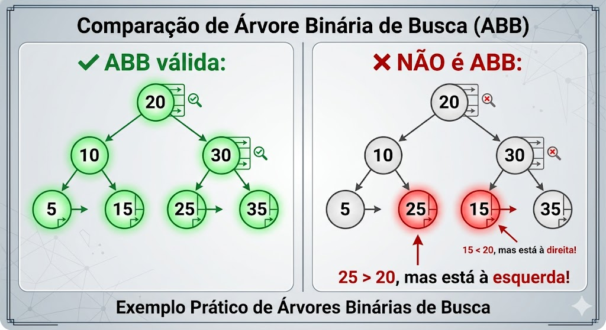
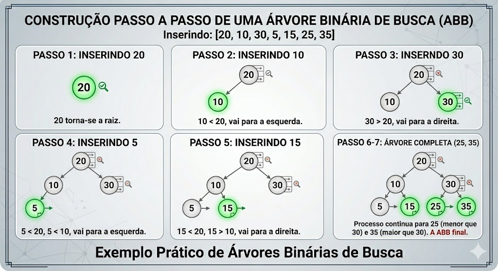

# Árvores Binárias de Busca

## 1. Revisão Motivadora: Busca Binária em Vetores

---

### 1.1 O Problema da Busca Eficiente

Considere que precisamos verificar se um número `x` está presente em um conjunto de dados.

| Estratégia | Requisito | Complexidade (Pior Caso) |
| --- | --- | --- |
| Busca linear | Nenhum | **O(n)** |
| **Busca binária** | **Dados ordenados** | **O(log n)** |

### 1.2 Busca Binária em Vetor Ordenado

```c
// Busca binária iterativa em vetor ordenado
int buscaBinaria(int vetor[], int n, int chave) {
    int esq = 0, dir = n - 1;

    while (esq <= dir) {
        int meio = (esq + dir) / 2;

        if (vetor[meio] == chave)
            return meio;              // Encontrou!
        else if (chave < vetor[meio])
            dir = meio - 1;           // Busca na metade esquerda
        else
            esq = meio + 1;           // Busca na metade direita
    }
    return -1;                        // Não encontrado
}
```

**Funcionamento:**

```
Vetor: [2, 5, 8, 12, 16, 23, 38, 45, 56, 67, 78]
Buscando: 23

Passo 1: [2...78] → meio=23 ✓ Encontrado em 1 comparação!

Buscando: 15
Passo 1: [2...78] → meio=23 → 15 < 23 → busca esquerda
Passo 2: [2...16] → meio=8  → 15 > 8  → busca direita
Passo 3: [12...16] → meio=12 → 15 > 12 → busca direita
Passo 4: [16] → meio=16 → 15 < 16 → busca esquerda
Passo 5: esq > dir → Não encontrado (4 comparações)
```

> ✅ **Vantagem:** Em vez de verificar todos os `n` elementos, a busca binária elimina **metade** dos candidatos a cada comparação.
> 

### 1.3 Limitação do Vetor para Inserções Dinâmicas

```c
// Problema: inserir um novo elemento mantendo a ordem
// Vetor: [2, 5, 8, 12, 16, 23, 38]
// Queremos inserir: 10

// Passo 1: encontrar posição (busca binária) → O(log n) ✓
// Passo 2: deslocar elementos para abrir espaço → O(n) ✗
// [2, 5, 8, _, 12, 16, 23, 38]
// [2, 5, 8, 10, 12, 16, 23, 38]
```

| Operação | Vetor Ordenado | Lista Encadeada |
| --- | --- | --- |
| Busca | O(log n) ✓ | O(n) ✗ |
| Inserção | O(n) ✗ | O(1)* ✓ |
| Remoção | O(n) ✗ | O(1)* ✓ |

> *Considerando que já temos o ponteiro para a posição
> 

**Pergunta motivadora:** Existe uma estrutura que combine:

- ✅ Busca eficiente como a binária (**O(log n)**)
- ✅ Inserção/remoção dinâmica sem deslocamentos?

**Resposta:** Sim! **Árvores Binárias de Busca (ABB)**.

---

## 2. Árvores Binárias de Busca: Definição e Propriedade Fundamental

### 2.1 Definição Formal

Uma **Árvore Binária de Busca (ABB)** é uma árvore binária que satisfaz a seguinte propriedade:

> **Propriedade da ABB:** Para todo nó `v` da árvore:
> 
> - Todos os valores na **subárvore à esquerda** de `v` são **menores** que `v.info`
> - Todos os valores na **subárvore à direita** de `v` são **maiores** que `v.info`
> - As subárvores à esquerda e à direita também são ABBs (recursividade)

### 2.2 Exemplos Visuais



### 2.3 Consequência Importante: Percurso Em-Ordem

> 💡 **Teorema:** O percurso **em-ordem** (Esquerda → Raiz → Direita) de uma ABB retorna os elementos em **ordem crescente**.
> 

```c
// Percurso em-ordem (já visto na aula anterior)
void emOrdem(No* raiz) {
    if (raiz != NULL) {
        emOrdem(raiz->esquerda);
        printf("%d ", raiz->valor);
        emOrdem(raiz->direita);
    }
}

// Para a ABB acima:
// Saída: 5 10 15 20 25 30 35  ← Ordenado! ✓
```

> Esta propriedade é extremamente útil para:
> 
> - Imprimir dados ordenados sem algoritmo de ordenação adicional
> - Validar se uma árvore é uma ABB
> - Obter o k-ésimo menor elemento com adaptações

---

## 3. Implementação em Linguagem C

### 3.1 Definição do Tipo de Dado

```c
#include <stdio.h>
#include <stdlib.h>
#include <stdbool.h>

// Definição do nó da ABB (valores inteiros)
typedef struct No {
    int valor;              // Chave de busca (pode ser adaptado para outros tipos)
    struct No* esquerda;    // Ponteiro para subárvore à esquerda
    struct No* direita;     // Ponteiro para subárvore à direita
} No;
```

### 3.2 Função Auxiliar: Criar Novo Nó

```c
// Cria um novo nó com o valor informado
No* criarNo(int valor) {
    No* novo = (No*) malloc(sizeof(No));
    if (novo == NULL) {
        fprintf(stderr, "Erro: falha ao alocar memória\\n");
        exit(EXIT_FAILURE);
    }
    novo->valor = valor;
    novo->esquerda = NULL;
    novo->direita = NULL;
    return novo;
}
```

### 3.3 Operação 1: Busca (Iterativa e Recursiva)

### a) Versão Recursiva (mais elegante)

```c
// Busca recursiva: retorna ponteiro para o nó ou NULL se não encontrado
No* buscar(No* raiz, int chave) {
    // Caso base 1: árvore vazia ou chegou em folha sem encontrar
    if (raiz == NULL) {
        return NULL;
    }

    // Caso base 2: encontrou a chave
    if (raiz->valor == chave) {
        return raiz;
    }

    // Caso recursivo: decide para qual subárvore seguir
    if (chave < raiz->valor) {
        return buscar(raiz->esquerda, chave);   // Busca à esquerda
    } else {
        return buscar(raiz->direita, chave);    // Busca à direita
    }
}
```

### b) Versão Iterativa (mais eficiente em espaço)

```c
// Busca iterativa: mesma lógica, sem recursão
No* buscarIterativo(No* raiz, int chave) {
    No* atual = raiz;

    while (atual != NULL) {
        if (chave == atual->valor) {
            return atual;              // Encontrou!
        } else if (chave < atual->valor) {
            atual = atual->esquerda;   // Vai para esquerda
        } else {
            atual = atual->direita;    // Vai para direita
        }
    }
    return NULL;  // Não encontrou
}
```

### c) Exemplo de Execução Passo a Passo

```
ABB:
        20
       /  \\
     10    30
    /  \\   /  \\
   5   15 25  35

Busca por 25:
1. raiz=20 → 25 > 20 → vai para direita
2. atual=30 → 25 < 30 → vai para esquerda
3. atual=25 → 25 == 25 ✓ Encontrado! (3 comparações)

Busca por 18:
1. raiz=20 → 18 < 20 → vai para esquerda
2. atual=10 → 18 > 10 → vai para direita
3. atual=15 → 18 > 15 → vai para direita
4. atual=NULL → ✗ Não encontrado (4 comparações)
```

### 3.4 Operação 2: Inserção

> **Estratégia:** Sempre inserir como **folha**, na posição correta determinada pela propriedade da ABB.
> 

```c
// Insere um novo valor na ABB (versão recursiva)
// Retorna a raiz da árvore (pode mudar na primeira inserção)
No* inserir(No* raiz, int valor) {
    // Caso base: encontrou posição vazia → cria novo nó
    if (raiz == NULL) {
        return criarNo(valor);
    }

    // Valor já existe → não insere duplicatas (opcional)
    if (valor == raiz->valor) {
        return raiz;  // ou tratar erro, dependendo da aplicação
    }

    // Decide para qual subárvore inserir recursivamente
    if (valor < raiz->valor) {
        raiz->esquerda = inserir(raiz->esquerda, valor);
    } else {
        raiz->direita = inserir(raiz->direita, valor);
    }

    return raiz;  // Retorna a mesma raiz (estrutura não mudou no nível atual)
}
```

### Exemplo Visual de Inserções Sequenciais



### 3.5 Operação 3: Remoção (Caso Mais Complexo)

> **Desafio:** Remover um nó mantendo a propriedade da ABB.
> 

Existem **três casos** a considerar:

### Caso 1: Nó é uma folha (sem filhos)

```
Antes:              Depois (remover 5):
    20                  20
   /  \\                /  \\
 10    30            10    30
 /  \\   /  \\         \\   /  \\
5   15 25  35         15 25  35
↑
remover

// Implementação: simplesmente libera o nó e retorna NULL
```

### Caso 2: Nó tem um único filho

```
Antes:              Depois (remover 10):
    20                  20
   /  \\                /  \\
 10    30            15    30
   \\   /  \\          /    /  \\
   15 25  35        5    25  35
  /
 5
↑
remover

// Implementação: "puxa" o filho para o lugar do pai
```

### Caso 3: Nó tem dois filhos (mais complexo)

> **Estratégia:** Substituir o valor do nó a ser removido pelo:
> 
> - **Sucessor**: menor valor da subárvore à direita (mais à esquerda), **ou**
> - **Antecessor**: maior valor da subárvore à esquerda (mais à direita)

```
Antes (remover 20):     Passo 1: encontrar sucessor (25):
        20                      20
       /  \\                    /  \\
	     10    30                10    30
    /  \\   /  \\             /  \\   /  \\
   5   15 25  35           5   15 25  35
                                   ↑
                              sucessor = 25

Passo 2: substituir 20 por 25:   Passo 3: remover o nó 25 original:
        25                              25
       /  \\                            /  \\
	     10    30                        10    30
    /  \\   /  \\                     /  \\    \\
   5   15 25  35                   5   15    35
           ↑
      (agora duplicado)
```

### Implementação Completa da Remoção

```c
// Função auxiliar: encontra o nó com menor valor (mais à esquerda)
No* encontrarMinimo(No* raiz) {
    while (raiz != NULL && raiz->esquerda != NULL) {
        raiz = raiz->esquerda;
    }
    return raiz;
}

// Remove um valor da ABB e retorna a nova raiz da subárvore
No* remover(No* raiz, int chave) {
    // Caso base: árvore vazia
    if (raiz == NULL) {
        return NULL;
    }

    // Encontra o nó a ser removido (busca padrão de ABB)
    if (chave < raiz->valor) {
        raiz->esquerda = remover(raiz->esquerda, chave);
    } else if (chave > raiz->valor) {
        raiz->direita = remover(raiz->direita, chave);
    }
    // Encontrou o nó: três casos
    else {
        // Caso 1: nó sem filhos ou com um filho à direita
        if (raiz->esquerda == NULL) {
            No* temp = raiz->direita;
            free(raiz);
            return temp;
        }
        // Caso 2: nó com um filho à esquerda
        else if (raiz->direita == NULL) {
            No* temp = raiz->esquerda;
            free(raiz);
            return temp;
        }
        // Caso 3: nó com dois filhos
        else {
            // Encontra o sucessor (menor da subárvore direita)
            No* sucessor = encontrarMinimo(raiz->direita);

            // Copia o valor do sucessor para o nó atual
            raiz->valor = sucessor->valor;

            // Remove o sucessor da subárvore direita (recursivamente)
            raiz->direita = remover(raiz->direita, sucessor->valor);
        }
    }
    return raiz;
}
```

### 3.6 Funções Utilitárias

```c
// Libera toda a memória (pós-ordem)
void liberarABB(No* raiz) {
    if (raiz != NULL) {
        liberarABB(raiz->esquerda);
        liberarABB(raiz->direita);
        free(raiz);
    }
}

// Imprime a ABB com identação (visualização hierárquica)
void imprimirABB(No* raiz, int nivel) {
    if (raiz == NULL) return;

    // Imprime subárvore direita primeiro (para visualização deitada)
    imprimirABB(raiz->direita, nivel + 1);

    // Imprime identação e valor
    for (int i = 0; i < nivel; i++) printf("    ");
    printf("%d\\n", raiz->valor);

    // Imprime subárvore esquerda
    imprimirABB(raiz->esquerda, nivel + 1);
}

// Conta o número de nós
int contarNos(No* raiz) {
    if (raiz == NULL) return 0;
    return 1 + contarNos(raiz->esquerda) + contarNos(raiz->direita);
}

// Calcula a altura da árvore
int altura(No* raiz) {
    if (raiz == NULL) return -1;
    int hEsq = altura(raiz->esquerda);
    int hDir = altura(raiz->direita);
    return 1 + (hEsq > hDir ? hEsq : hDir);
}
```

---

## 4. Código Completo de Exemplo

```c
#include <stdio.h>
#include <stdlib.h>

typedef struct No {
    int valor;
    struct No* esquerda;
    struct No* direita;
} No;

No* criarNo(int valor) {
    No* novo = (No*) malloc(sizeof(No));
    if (!novo) { fprintf(stderr, "Erro de alocação\\n"); exit(1); }
    novo->valor = valor;
    novo->esquerda = novo->direita = NULL;
    return novo;
}

No* buscar(No* raiz, int chave) {
    if (!raiz || raiz->valor == chave) return raiz;
    return (chave < raiz->valor) ? buscar(raiz->esquerda, chave)
                                 : buscar(raiz->direita, chave);
}

No* inserir(No* raiz, int valor) {
    if (!raiz) return criarNo(valor);
    if (valor < raiz->valor)
        raiz->esquerda = inserir(raiz->esquerda, valor);
    else if (valor > raiz->valor)
        raiz->direita = inserir(raiz->direita, valor);
    return raiz;
}

No* encontrarMinimo(No* raiz) {
    while (raiz && raiz->esquerda) raiz = raiz->esquerda;
    return raiz;
}

No* remover(No* raiz, int chave) {
    if (!raiz) return NULL;

    if (chave < raiz->valor)
        raiz->esquerda = remover(raiz->esquerda, chave);
    else if (chave > raiz->valor)
        raiz->direita = remover(raiz->direita, chave);
    else {
        if (!raiz->esquerda) {
            No* temp = raiz->direita;
            free(raiz);
            return temp;
        } else if (!raiz->direita) {
            No* temp = raiz->esquerda;
            free(raiz);
            return temp;
        } else {
            No* sucessor = encontrarMinimo(raiz->direita);
            raiz->valor = sucessor->valor;
            raiz->direita = remover(raiz->direita, sucessor->valor);
        }
    }
    return raiz;
}

void emOrdem(No* raiz) {
    if (raiz) {
        emOrdem(raiz->esquerda);
        printf("%d ", raiz->valor);
        emOrdem(raiz->direita);
    }
}

void imprimirABB(No* raiz, int nivel) {
    if (!raiz) return;
    imprimirABB(raiz->direita, nivel + 1);
    for (int i = 0; i < nivel; i++) printf("    ");
    printf("%d\\n", raiz->valor);
    imprimirABB(raiz->esquerda, nivel + 1);
}

void liberarABB(No* raiz) {
    if (raiz) {
        liberarABB(raiz->esquerda);
        liberarABB(raiz->direita);
        free(raiz);
    }
}

int main() {
    No* raiz = NULL;

    // Inserindo valores
    int valores[] = {20, 10, 30, 5, 15, 25, 35};
    for (int i = 0; i < 7; i++) {
        raiz = inserir(raiz, valores[i]);
    }

    printf("Árvore após inserções (visualização rotacionada 90°):\\n");
    imprimirABB(raiz, 0);

    printf("\\nPercurso em-ordem (deve sair ordenado): ");
    emOrdem(raiz);
    printf("\\n");

    // Testando busca
    int chave = 25;
    if (buscar(raiz, chave))
        printf("✓ %d encontrado na árvore\\n", chave);
    else
        printf("✗ %d não encontrado\\n", chave);

    // Removendo um nó com dois filhos
    printf("\\nRemovendo 20 (nó com dois filhos)...\\n");
    raiz = remover(raiz, 20);
    imprimirABB(raiz, 0);

    printf("\\nEm-ordem após remoção: ");
    emOrdem(raiz);
    printf("\\n");

    // Estatísticas
    printf("\\nEstatísticas:\\n");
    printf("  Nós: %d\\n", contarNos(raiz));
    printf("  Altura: %d\\n", altura(raiz));

    liberarABB(raiz);
    return 0;
}
```

**Saída esperada:**

```
Árvore após inserções (visualização rotacionada 90°):
        35
    30
        25
20
        15
    10
        5

Percurso em-ordem (deve sair ordenado): 5 10 15 20 25 30 35
✓ 25 encontrado na árvore

Removendo 20 (nó com dois filhos)...
        35
    30
        25
25
        15
    10
        5

Em-ordem após remoção: 5 10 15 25 30 35

Estatísticas:
  Nós: 6
  Altura: 3
```

---

## 5. Análise de Complexidade

### 5.1 Fator Determinante: Altura da Árvore

Todas as operações básicas (busca, inserção, remoção) dependem do **caminho da raiz até uma folha**, ou seja, da **altura `h`** da árvore.

| Operação | Complexidade |
| --- | --- |
| Busca | **O(h)** |
| Inserção | **O(h)** |
| Remoção | **O(h)** |
| Em-ordem (todos os nós) | **O(n)** |

### 5.2 Melhor Caso vs. Pior Caso

```
Melhor Caso: Árvore Balanceada (cheia/completa)
            • Altura h ≈ log₂(n)
            • Complexidade: O(log n) ✓

        Exemplo (n=7, h=2):
                •
               / \\
              •   •
             / \\ / \\
            •  ••  •

Pior Caso: Árvore Degenerada (linear)
            • Altura h = n-1
            • Complexidade: O(n) ✗ (equivalente a lista encadeada)

        Exemplo (inserção em ordem crescente):
            1
             \\
              2
               \\
                3
                 \\
                  4
                   \\
                    5
```

### 5.3 Tabela Comparativa: ABB vs. Outras Estruturas

| Estrutura | Busca | Inserção | Remoção | Ordenação Natural |
| --- | --- | --- | --- | --- |
| Vetor não-ordenado | O(n) | O(1)* | O(n) | ✗ |
| Vetor ordenado | O(log n) | O(n) | O(n) | ✓ |
| Lista encadeada | O(n) | O(1)** | O(1)** | ✗ |
| **ABB (balanceada)** | **O(log n)** | **O(log n)** | **O(log n)** | **✓** |
| ABB (degenerada) | O(n) | O(n) | O(n) | ✓ |

> *Inserção no final; **Considerando ponteiro para a posição
> 

---

## 6. Exercícios para Fixação

### Exercício 1 — Construção Manual

Dada a sequência de inserções: `[50, 30, 70, 20, 40, 60, 80, 10]`

a) Desenhe a ABB resultante passo a passo.

b) Qual a altura da árvore final?

c) Escreva o percurso em-ordem (deve sair ordenado).

d) Quantas comparações são necessárias para buscar o valor `10`?

<details>
<summary>💡 Gabarito parcial</summary>

```
a) Árvore final:
           50
         /    \\
       30      70
      /  \\    /  \\
    20   40  60  80
   /
 10

b) Altura = 3 (caminho 50→30→20→10)
c) Em-ordem: 10 20 30 40 50 60 70 80
d) Busca por 10: 50→30→20→10 = 4 comparações
```

</details>

### Exercício 2 — Remoção Passo a Passo

Partindo da árvore do Exercício 1, execute as remoções na ordem: `[30, 70, 50]`

a) Para cada remoção, identifique qual caso se aplica (0, 1 ou 2 filhos).

b) Desenhe a árvore após cada remoção.

c) Verifique se a propriedade da ABB foi mantida.

### Exercício 3 — Validação de ABB

Implemente uma função que verifique se uma árvore binária qualquer é uma ABB válida:

```c
bool ehABB(No* raiz);
```

> 💡 **Dica:** Não basta verificar `esquerda < raiz < direita` localmente. É necessário garantir que **todos** os nós da subárvore esquerda sejam menores que a raiz, e **todos** da direita sejam maiores. Uma abordagem eficiente usa limites mínimos e máximos propagados recursivamente.
> 

<details>
<summary>💡 Esboço de solução</summary>

```c
bool ehABBAux(No* raiz, int min, int max) {
    if (raiz == NULL) return true;
    if (raiz->valor <= min || raiz->valor >= max) return false;
    return ehABBAux(raiz->esquerda, min, raiz->valor) &&
           ehABBAux(raiz->direita, raiz->valor, max);
}

bool ehABB(No* raiz) {
    return ehABBAux(raiz, INT_MIN, INT_MAX);
}
```

</details>

### Exercício 4 — Altura Mínima e Máxima

Para uma ABB com `n = 15` nós:

a) Qual a **menor altura possível**? Qual tipo de árvore atinge esse valor?

b) Qual a **maior altura possível**? Qual sequência de inserções produz essa árvore?

c) Calcule a diferença no número máximo de comparações para busca entre os dois casos.

<details>
<summary>💡 Respostas</summary>

```
a) Menor altura: h = ⌊log₂(15)⌋ = 3 (árvore cheia/completa)
b) Maior altura: h = 14 (árvore degenerada, inserção em ordem crescente ou decrescente)
c) Diferença: 14 - 3 = 11 comparações extras no pior caso!
   Isso justifica a necessidade de árvores balanceadas.
```

</details>

### Exercício 5 — Desafio: Inserção em Lote

Escreva uma função que receba um vetor de inteiros e construa uma ABB contendo todos os valores:

```c
No* construirABB(int vetor[], int n);
```

Teste com:

- Vetor aleatório: `[42, 17, 89, 5, 33, 71, 12]`
- Vetor ordenado: `[1, 2, 3, 4, 5, 6, 7]` ← **Atenção ao resultado!**

Compare a altura das duas árvores resultantes.

---

## 7. Questionamento Final: O Problema da Degeneração

### 7.1 Experimento Mental

Considere inserir os valores **em ordem crescente**: `[1, 2, 3, 4, 5, 6, 7]`

```
Passo 1: [1]          Passo 4: [1,2,3,4]
  1                        1
                            \\
                             2
                              \\
                               3
                                \\
                                 4

Passo 7: [1,2,3,4,5,6,7] — Árvore degenerada:
1
 \\
  2
   \\
    3
     \\
      4
       \\
        5
         \\
          6
           \\
            7
```

### 7.2 Consequências

| Métrica | Árvore Balanceada | Árvore Degenerada |
| --- | --- | --- |
| Altura | ≈ log₂(7) = 2~3 | 6 |
| Busca (pior caso) | 3 comparações | 7 comparações |
| Inserção | O(log n) | O(n) |
| Uso de memória (pilha recursiva) | O(log n) | O(n) ⚠️ risco de estouro |

> ❗ **Problema:** A ABB **não garante** balanceamento automaticamente. A estrutura final depende da **ordem de inserção** dos dados.
> 

### 7.3 Pergunta para Reflexão

> Se inserirmos dados já ordenados (comum em aplicações reais: registros por timestamp, IDs sequenciais, etc.), a ABB degenera para uma estrutura linear, perdendo sua vantagem de **O(log n)**.
> 

**Como resolver?**

```
🔜 Próxima aula: Árvores Balanceadas
• AVL: balanceamento por fator de altura
• Rubro-Negra: balanceamento por cores e regras de rotação
• Ideia central: realizar rotações durante inserção/remoção
  para manter a altura próxima de log₂(n)
```

```
Exemplo de rotação simples (AVL):

Antes da rotação (desbalanceada à direita):      Após rotação à esquerda:
        A                                                B
         \\                                              / \\
          B                                            A   C
           \\
            C

• A altura diminui de 2 para 1
• A propriedade da ABB é preservada
• Operações continuam em O(log n) garantido
```

---

## 8. Resumo da Aula

✅ **Conexão com busca binária**

- ABB generaliza a busca binária para estrutura dinâmica
- Mantém dados "virtualmente ordenados" sem necessidade de vetor contíguo

✅ **Propriedade fundamental da ABB**

- Esquerda < Raiz < Direita (para todos os nós, recursivamente)
- Percurso em-ordem retorna elementos ordenados

✅ **Operações básicas em C**

- `buscar()`: O(h) — recursiva ou iterativa
- `inserir()`: O(h) — sempre como folha, mantendo a propriedade
- `remover()`: O(h) — três casos (0, 1 ou 2 filhos), uso do sucessor/antecessor

✅ **Análise de complexidade**

- Depende da altura `h`: O(h) para operações pontuais
- Melhor caso (balanceada): h ≈ log n → O(log n)
- Pior caso (degenerada): h = n-1 → O(n)

✅ **Boas práticas**

- Sempre verificar `malloc`
- Liberar memória com `free()` em pós-ordem
- Evitar duplicatas (ou definir política de tratamento)
- Considerar altura ao projetar aplicações críticas

✅ **Limitação importante**

- ABB **não se auto-balanceia** → ordem de inserção impacta desempenho
- Gancho para estudo de **árvores AVL e Rubro-Negras**

---

## 9. Próximos Passos (Para Estudo Autônomo)

🔜 **Tópicos da próxima aula: Árvores Balanceadas**

- Fator de balanceamento e altura
- Rotações simples e duplas (LL, RR, LR, RL)
- Inserção e remoção em AVL com rebalanceamento
- Comparação prática: ABB vs. AVL em cenários reais

📚 **Leitura recomendada:**

- ZIVIANI, N. *Projeto de Algoritmos*. Seção 5.3: Árvores Binárias de Busca.
- CORMEN et al. *Introduction to Algorithms*. Capítulo 12: Binary Search Trees.

💻 **Prática sugerida:**

1. Compile e teste o código completo da Seção 4
2. Implemente a função `ehABB()` do Exercício 3
3. Experimente inserir sequências ordenadas e aleatórias, medindo a altura resultante
4. (Desafio) Implemente uma função que imprime a ABB em formato gráfico ASCII

---

> 📌 **Dica para provas:** Ao desenhar ABBs, sempre verifique a propriedade "esquerda < raiz < direita" para **todos** os nós, não apenas os vizinhos. Um erro comum é validar apenas localmente e esquecer que um nó na subárvore esquerda deve ser menor que **todos** os ancestrais à direita.
> 

---

*Material elaborado para a disciplina de Estrutura de Dados — Curso de Engenharia de Computação*

*Prof. Sérgio Souza Costa | Atualizado: 2026*