# Árvores AVL: Conceito

!!! note "Material de Apoio"
    Você pode acompanhar este capítulo utilizando os [Slides sobre Árvores AVL](../slides/arvores_avl.pdf).

---

## 1. Revisão & Motivação: O Problema da Degeneração

No capítulo anterior, vimos que a **Árvore Binária de Busca (ABB)** oferece busca, inserção e remoção em **O(h)**, onde `h` é a altura da árvore. Contudo, a ABB **não garante** que a árvore permaneça balanceada.

### O que acontece com dados inseridos em ordem?

Sequência: `[1, 2, 3, 4, 5, 6, 7]`

ABB resultante:

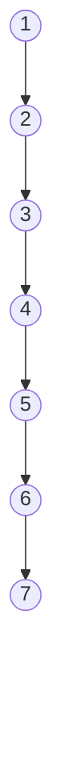

- **Altura:** `h = 6` (para `n = 7`)
- **Complexidade de busca:** `O(n)` → Equivale a uma lista encadeada!
- **Conclusão:** O desempenho da ABB depende criticamente da **ordem de inserção**.

### O ideal: Árvore Balanceada

Mesmos dados, mas balanceados:

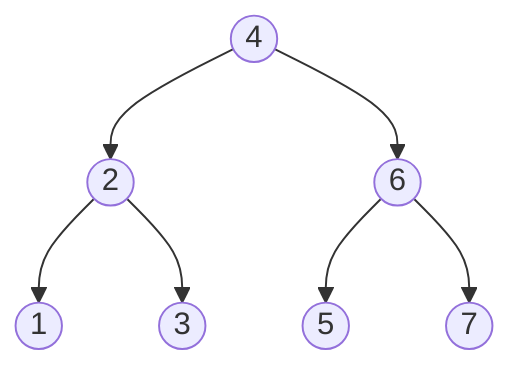

- **Altura:** `h = 2`
- **Complexidade de busca:** `O(log n)`
- **Vantagem:** Garantia teórica de eficiência, independente da ordem de entrada.

!!! question "Pergunta chave"
    Como manter a árvore balanceada automaticamente durante inserções e remoções?

---

## 2. Árvores AVL: Definição Formal

Criada em 1962 por **Adelson-Velsky e Landis**, a **Árvore AVL** é uma ABB com uma restrição adicional de balanceamento:

> **Definição:** Uma árvore binária de busca é uma **AVL** se, para **todo nó** da árvore, a diferença entre as alturas de suas subárvores esquerda e direita for, no máximo, **1 unidade**.

### 2.1 Fator de Balanceamento (FB)

Para medir essa diferença, calculamos o **Fator de Balanceamento** de cada nó:

```
FB(nó) = altura(SAE) − altura(SAD)
```

Onde:

- `SAE` = Subárvore à Esquerda
- `SAD` = Subárvore à Direita
- `altura(∅) = -1` (convenção usual) ou `0` (conforme material de referência). *Usaremos altura de folha = 0 para facilitar a contagem manual.*

| Valor do FB | Significado |
| --- | --- |
| `-1` | Subárvore direita é 1 nível mais profunda |
| `0` | Subárvores com mesma altura (perfeitamente balanceado) |
| `+1` | Subárvore esquerda é 1 nível mais profunda |
| `≤ -2` ou `≥ +2` | **Nó desbalanceado** → requer rotação |

### 2.2 Exemplo de Verificação

**Árvore A:**

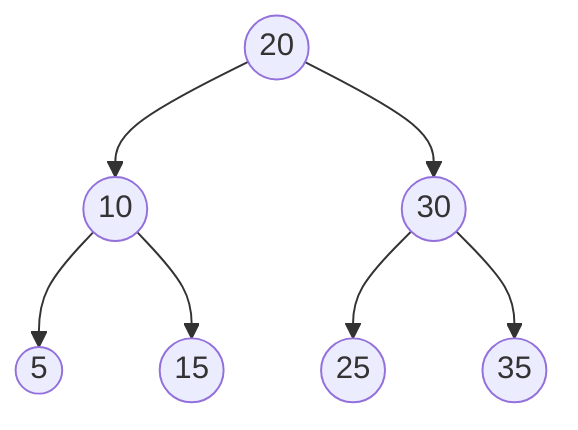

**Árvore B:**

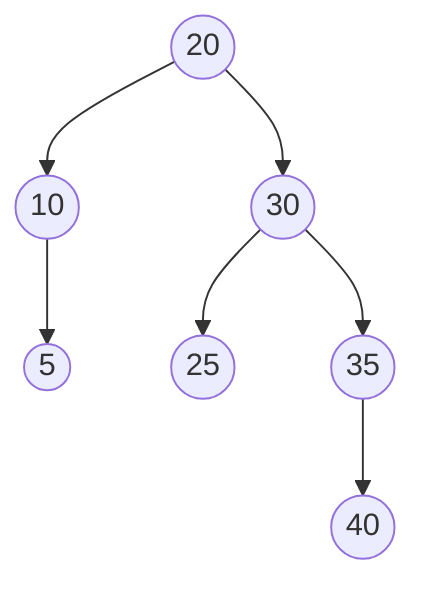

Alturas (folha = 0):

| Árvore A | Árvore B |
| --- | --- |
| FB(5)=0, FB(15)=0 | FB(5)=0 |
| FB(10)=0-0=0 | FB(10)=0-(-1)=1 ✓ |
| FB(25)=0, FB(35)=0 | FB(25)=0 |
| FB(30)=0-0=0 | FB(35)=1-(-1)=1 ✓ |
| FB(20)=0-0=0 ✓ (AVL!) | FB(20)=2-1=1 ✓ (AVL!) |

Ambas são AVLs válidas. A diferença está na distribuição, mas nenhuma viola `|FB| ≤ 1`.

---

## 3. Rotações: O Mecanismo de Rebalanceamento

Quando um nó fica com `|FB| ≥ 2`, aplicamos **rotações**. Rotações são rearranjos locais de ponteiros que:

1. **Preservam a propriedade da ABB** (esquerda < raiz < direita)
2. **Reduzem a altura** da subárvore afetada
3. **Restauram** `|FB| ≤ 1`

Existem **4 configurações** e **4 rotações** correspondentes:

### 3.1 Rotação Simples à Direita (Caso LL)

**Ocorre quando:** Desbalanceamento na **esquerda** e o filho à esquerda também está "pesado" na **esquerda**.

**Antes (FB = +2):**

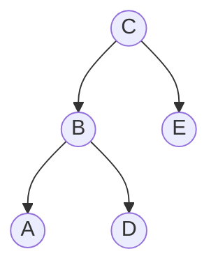

**Depois da Rotação à Direita:**

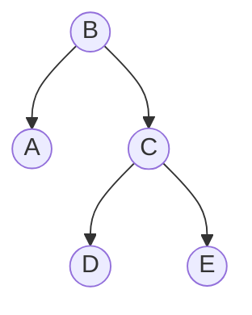

- B sobe, C desce para a direita
- D (filho direito de B) passa a ser filho esquerdo de C
- Propriedade ABB mantida: A < B < D < C < E

### 3.2 Rotação Simples à Esquerda (Caso RR)

**Ocorre quando:** Desbalanceamento na **direita** e o filho à direita também está "pesado" na **direita**.

**Antes (FB = -2):**

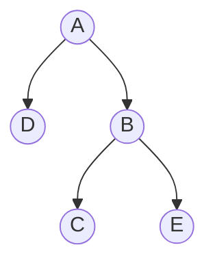

**Depois da Rotação à Esquerda:**

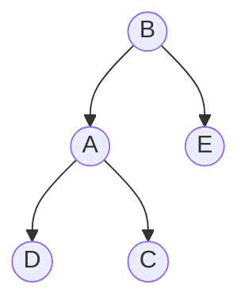

- B sobe, A desce para a esquerda
- C (filho esquerdo de B) passa a ser filho direito de A
- Ordem mantida: A < C < B < E

### 3.3 Rotação Dupla Esquerda-Direita (Caso LR)

**Ocorre quando:** Desbalanceamento na **esquerda**, mas o filho esquerdo está "pesado" na **direita**.
**Solução:** Duas rotações simples:

1. Rotação à **esquerda** no filho esquerdo
2. Rotação à **direita** no nó desbalanceado

**Antes:**

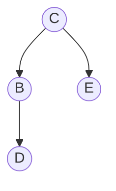

**Passo 1 (Rotação Esquerda em B):**

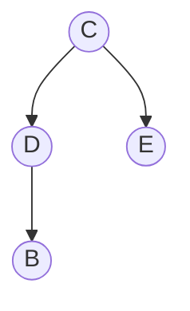

**Passo 2 (Rotação Direita em C):**

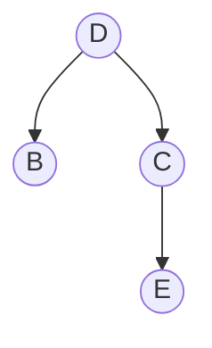

### 3.4 Rotação Dupla Direita-Esquerda (Caso RL)

**Ocorre quando:** Desbalanceamento na **direita**, mas o filho direito está "pesado" na **esquerda**.
**Solução:**

1. Rotação à **direita** no filho direito
2. Rotação à **esquerda** no nó desbalanceado

**Antes:**

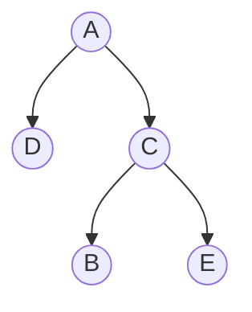

**Passo 1 (Rotação Direita em C):**

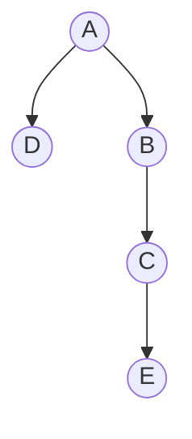

**Passo 2 (Rotação Esquerda em A):**

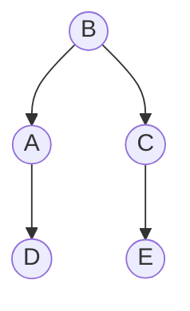

!!! tip "Regra prática para identificar a rotação"
    Siga o caminho do nó inserido até a raiz. O primeiro nó com `|FB| ≥ 2` é o **nó desbalanceado**. Olhe para os dois primeiros passos do caminho a partir dele:

    - `Esquerda → Esquerda` → Rotação Simples à Direita
    - `Direita → Direita` → Rotação Simples à Esquerda
    - `Esquerda → Direita` → Rotação Dupla (Esq-Dir)
    - `Direita → Esquerda` → Rotação Dupla (Dir-Esq)

---

## 4. Algoritmo Conceitual de Inserção em AVL

1. **Insira** o novo nó exatamente como em uma ABB comum (sempre como folha).
2. **Suba** da folha inserida em direção à raiz, recalculando alturas e FB de cada ancestral.
3. No **primeiro nó** onde `|FB| ≥ 2`:
    - Identifique o tipo de desbalanceamento (LL, RR, LR, RL)
    - Aplique a rotação correspondente
    - Atualize alturas/FB dos nós envolvidos
4. **Pare** (uma única rotação é suficiente para rebalancear toda a árvore após uma inserção).
5. Continue verificando se necessário (em remoções, pode exigir mais de uma rotação, mas em inserções, uma basta).

---

## 5. Exemplos Visuais Passo a Passo

### Exemplo 1: Inserção de `[10, 20, 30]`

**1. Inserir 10:**

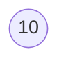

FB: 10 → OK

**2. Inserir 20:**

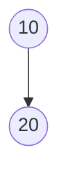

FB: 10 → 0-1 = -1, OK

**3. Inserir 30:**

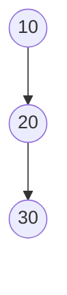

FB: 10 → 0-2 = -2 ❌ Desbalanceado! (Caso RR)

→ Aplicar Rotação Simples à Esquerda em 10:

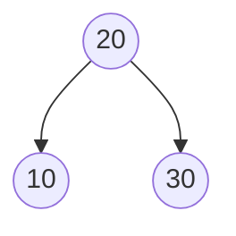

FB atualizados: 10→0, 30→0, 20→0. Árvore balanceada! ✓

### Exemplo 2: Inserção de `[30, 10, 20]`

**1. Insere 30:**


**2. Insere 10:**

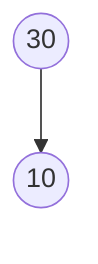

**3. Insere 20:**

```mermaid
graph TD
    E3_30((30)) --> E3_10((10))
    E3_10 --> E3_20((20))
```

FB(30) = 2-0 = +2 ❌ → Nó desbalanceado. Caminho: 30 → Esq(10) → Dir(20). Tipo: **LR (Esquerda-Direita)**

**Passo 1: Rotação Esq em 10 → 20 sobe, 10 desce à esquerda**

```mermaid
graph TD
    P1_30((30)) --> P1_20((20))
    P1_20 --> P1_10((10))
```

**Passo 2: Rotação Dir em 30 → 20 sobe, 30 desce à direita**

```mermaid
graph TD
    P2_20((20)) --> P2_10((10))
    P2_20 --> P2_30((30))
```

FB: todos 0. AVL válida! ✓

### Exemplo 3: Inserção de `[10, 30, 20, 40, 35]`

Inserimos: 10 → 30 → 20 → 40

```mermaid
graph TD
    A10((10)) --> A30((30))
    A30 --> A20((20))
    A30 --> A40((40))
```

FB(10) = 0-2 = -2 ❌ → Caminho: 10 → Dir(30) → Esq(20). Tipo: **RL (Direita-Esquerda)**

**Passo 1: Rotação Dir em 30 → 20 sobe, 30 desce à direita**

```mermaid
graph TD
    B10((10)) --> B20((20))
    B20 --> B30((30))
    B30 --> B40((40))
```

**Passo 2: Rotação Esq em 10 → 20 sobe, 10 desce à esquerda**

```mermaid
graph TD
    C20((20)) --> C10((10))
    C20 --> C30((30))
    C30 --> C40((40))
```

FB: 10→0, 40→0, 30→-1, 20→0. Balanceada! ✓

**Agora inserimos 35:**

```mermaid
graph TD
    D20((20)) --> D10((10))
    D20 --> D30((30))
    D30 --> D40((40))
    D40 --> D35((35))
```

FB(30) = -1-1 = -2 ❌ → Caminho: 30 → Dir(40) → Esq(35). Tipo: **RL novamente!**

**Rotação Dir em 40 → 35 sobe, 40 desce à direita**

```mermaid
graph TD
    E20((20)) --> E10((10))
    E20 --> E30((30))
    E30 --> E35((35))
    E35 --> E40((40))
```

**Rotação Esq em 30 → 35 sobe, 30 desce à esquerda**

```mermaid
graph TD
    F20((20)) --> F10((10))
    F20 --> F35((35))
    F35 --> F30((30))
    F35 --> F40((40))
```

FB: todos ≤1. AVL válida! ✓

---

## 6. Ferramenta Interativa: VisuAlgo

### Acesse: **[https://visualgo.net/en/bst](https://visualgo.net/en/bst)**

O **VisuAlgo** é uma ferramenta visual interativa que permite:

- Inserir e remover elementos em ABBs e AVLs
- **Visualizar automaticamente** as rotações acontecendo em tempo real
- Ver os fatores de balanceamento calculados automaticamente
- Comparar seu resultado manual com a solução correta
- Estudar diferentes sequências de inserção

### Como usar para estudar AVL:

1. **Acesse o site** e selecione o modo "AVL" (não apenas BST)
2. **Insira os valores** um por um na caixa de texto
3. **Observe** como a árvore se reorganiza automaticamente
4. **Compare** com seus desenhos feitos no papel
5. **Teste** sequências ordenadas `[1,2,3,4,5]` vs aleatórias `[3,1,4,2,5]`
6. **Verifique** se identificou corretamente o tipo de rotação necessária

!!! tip "Dica de estudo"
    - Primeiro resolva os exercícios no papel
    - Depois valide no VisuAlgo
    - Se houver diferença, analise passo a passo onde errou
    - Preste atenção nas alturas e FB mostrados visualmente

---

## 7. Exercícios para Fixação (Manipulação Visual)

!!! note "Instrução"
    Utilize papel, lápis e borracha. Não é necessário código. Desenhe as árvores, calcule alturas e FB, e aplique rotações quando necessário. **Valide suas respostas no VisuAlgo ([https://visualgo.net/en/bst](https://visualgo.net/en/bst))**.

### Exercício 1 — Cálculo de FB e Identificação de Desbalanceamento

Dada a árvore abaixo:

```mermaid
graph TD
    N50((50)) --> N30((30))
    N50 --> N70((70))
    N30 --> N20((20))
    N30 --> N40((40))
    N70 --> N80((80))
    N20 --> N10((10))
    N80 --> N75((75))
```

a) Calcule a altura de cada nó.

b) Calcule o FB de cada nó.

c) Há algum nó desbalanceado? Se sim, qual?

d) Qual tipo de rotação seria necessária?

<details>
<summary>Gabarito</summary>

a) Alturas (folha=0): 10→0, 20→1, 40→0, 75→0, 80→1, 30→2, 70→2, 50→3

b) FB: 10→0, 20→1-0=1, 40→0, 75→0, 80→0-1=-1, 30→1-0=1, 70→0-2=-2, 50→2-2=0

c) Sim: nó **70** tem FB = -2

d) Caminho do nó inserido (75): 70 → Dir(80) → Esq(75) → **Caso RL** → Rotação Dupla Direita-Esquerda

**Valide no VisuAlgo:** Insira [50,30,70,20,40,80,10,75] e observe o desbalanceamento
</details>

---

### Exercício 2 — Inserção Sequencial com Rebalanceamento

Insira os valores na ordem: `[20, 10, 30, 5, 15, 25, 35, 3]` em uma AVL inicialmente vazia.

- Desenhe a árvore após cada inserção.
- Marque o FB de cada nó.
- Sempre que `|FB| ≥ 2`, aplique a rotação necessária antes de continuar.

<details>
<summary>Dica de resolução</summary>

- Após `20,10,30`: balanceada (20 raiz)
- Após `5`: 20 FB=1, 10 FB=1, 30 FB=0 ✓
- Após `15`: 20 FB=1-0=1, 10 FB=1-1=0, 15 FB=0, 5 FB=0 ✓
- Após `25,35`: 20 FB=1-2=-1, 30 FB=0-1=-1, 35 FB=0 ✓
- Após `3`: 10 FB=2-0=2 ❌ → Caso LL (caminho 10→Esq(5)→Esq(3)) → Rotação Simples à Direita em 10
- Árvore final balanceada:

```mermaid
graph TD
    N20((20)) --> N5((5))
    N20 --> N30((30))
    N5 --> N3((3))
    N5 --> N10((10))
    N10 --> N15((15))
    N30 --> N25((25))
    N30 --> N35((35))
```

**Valide no VisuAlgo:** Insira a sequência completa e compare com seu desenho
</details>

---

### Exercício 3 — Identificação de Rotação

Para cada situação abaixo, identifique:

1. Qual nó está desbalanceado?
2. Qual o tipo de desbalanceamento (LL, RR, LR, RL)?
3. Qual rotação deve ser aplicada?

**Situação A:**

```mermaid
graph TD
    A40((40)) --> A20((20))
    A20 --> A10((10))
    A20 --> A30((30))
```

**Situação B:**

```mermaid
graph TD
    B50((50)) --> B80((80))
    B80 --> B70((70))
    B80 --> B90((90))
    B70 --> B60((60))
```

<details>
<summary>Gabarito</summary>

Situação A:

1. Nó 40 (FB = +2)
2. Caminho: 40 → Esq(20) → Dir(30) → **LR**
3. Rotação Dupla Esquerda-Direita (Esq em 20, depois Dir em 40)

Situação B:

1. Nó 50 (FB = -2)
2. Caminho: 50 → Dir(80) → Esq(70) → **RL**
3. Rotação Dupla Direita-Esquerda (Dir em 80, depois Esq em 50)

**Valide no VisuAlgo:** Recrie cada situação e observe a rotação sugerida
</details>

---

### Exercício 4 — Desafio Visual: Degeneração vs. Balanceamento

1. Desenhe a ABB resultante da inserção de `[1, 2, 3, 4, 5, 6, 7]` em ordem crescente.
2. Desenhe a AVL resultante da mesma sequência.
3. Compare altura, número de comparações máximas para busca e eficiência geral.
4. Explique por que a AVL nunca degenera, mesmo com dados ordenados.

<details>
<summary>Resposta esperada</summary>

1. ABB: Lista encadeada à direita. Altura = 6. Busca pior caso = 7 comparações.
2. AVL:

```mermaid
graph TD
    N4((4)) --> N2((2))
    N4 --> N6((6))
    N2 --> N1((1))
    N2 --> N3((3))
    N6 --> N5((5))
    N6 --> N7((7))
```

Altura = 2. Busca pior caso = 3 comparações.
3. Diferença drástica: O(n) vs O(log n). A AVL realiza rotações automáticas que redistribuem os nós, mantendo a altura próxima de log₂(n).
4. Porque a propriedade `|FB| ≤ 1` força rearranjos locais sempre que a diferença de alturas ameaça crescer, impedindo o crescimento linear.

**Valide no VisuAlgo:**

- Modo BST: insira [1,2,3,4,5,6,7] → veja a degeneração
- Modo AVL: insira [1,2,3,4,5,6,7] → veja o balanceamento automático
</details>

---

### Exercício 5 — Prática Guiada com VisuAlgo

**Sequência:** `[50, 25, 75, 10, 30, 60, 90, 5, 15, 28, 55, 65]`

Para cada inserção:

1. Pause o VisuAlgo antes de inserir
2. Desenhe no papel como você acha que a árvore ficará
3. Preveja se haverá rotação e qual tipo
4. Clique em "Insert" no VisuAlgo
5. Compare com sua previsão
6. Anote eventuais erros de raciocínio

!!! note "Objetivo"
    Desenvolver intuição para prever quando e qual rotação ocorrerá.

---

## 8. Resumo do Capítulo

**Motivação:** ABBs degeneram com inserções ordenadas → perda de eficiência O(log n)

**Definição AVL:** ABB com `|altura(SAE) − altura(SAD)| ≤ 1` para todos os nós

**Fator de Balanceamento (FB):** Ferramenta para medir desbalanceamento. Valores válidos: `-1, 0, +1`

**Rotações:** 4 tipos para restaurar equilíbrio mantendo a propriedade ABB:

- LL → Rotação Simples à Direita
- RR → Rotação Simples à Esquerda
- LR → Rotação Dupla (Esq-Dir)
- RL → Rotação Dupla (Dir-Esq)

**Algoritmo de Inserção:** Inserir como ABB → subir atualizando FB → rotacionar no primeiro `|FB| ≥ 2`

**Garantia:** Altura sempre `O(log n)` → operações sempre eficientes

**Ferramenta de estudo:** **[https://visualgo.net/en/bst](https://visualgo.net/en/bst)** para validação e prática interativa

---

## 9. Próximos Passos & Ferramentas Recomendadas

**Próximo capítulo:** Implementação em C de AVLs (struct com campo `altura`, funções de rotação, inserção com rebalanceamento automático, remoção avançada).

**Prática sugerida (sem código):**

- Utilize o simulador interativo: [https://visualgo.net/en/bst](https://visualgo.net/en/bst)
- Selecione o modo "AVL"
- Insira sequências aleatórias e observe as rotações acontecendo em tempo real
- Tente prever a rotação antes de clicar em "Inserir"
- Teste casos extremos: dados ordenados, dados em ordem inversa, dados aleatórios
- Compare o comportamento do modo "BST" vs "AVL" com as mesmas sequências

**Leitura complementar:**

- ZIVIANI, N. *Projeto de Algoritmos*. Seção 5.4: Árvores AVL.
- GOODRICH, M. T. *Data Structures and Algorithms in C*. Capítulo 11: Balanced Search Trees.

---

!!! note "Dica para provas"
    Ao resolver exercícios de AVL no papel, **sempre escreva as alturas e FB ao lado de cada nó**. Isso evita erros de contagem e facilita a identificação imediata do caso de rotação. **Use o VisuAlgo para treinar e validar seu raciocínio!**

---

*Material elaborado para a disciplina de Estrutura de Dados — Curso de Engenharia de Computação*

*Prof. Sérgio Souza Costa | Atualizado: 2026*

---