# AVL - Implementação

## 1. Revisão Rápida: Por Que Implementar AVL?

---

No capítulo anterior, vimos que:

| Situação | ABB Comum | AVL |
| --- | --- | --- |
| Inserção ordenada `[1,2,3,4,5]` | Degenera → O(n) | Balanceada → O(log n) |
| Fator de balanceamento | Não verifica | Verifica automaticamente (`\|FB\| ≤ 1`) |
| Rebalanceamento | Não faz | Rotações automáticas |

!!! question "Ideia central da implementação"
    A cada inserção, devemos:

    1. Inserir como em uma ABB normal
    2. **Atualizar a altura** dos nós ancestrais
    3. **Verificar o FB** e aplicar rotação se necessário

---

## 2. Estrutura de Dados: O Nó AVL

A principal diferença para uma ABB comum é o campo `altura`:

```c
#include <stdio.h>
#include <stdlib.h>

// Estrutura do nó AVL
typedef struct No {
    int chave;              // Valor armazenado
    int altura;             // Altura do nó (essencial para balanceamento!)
    struct No *esq;         // Ponteiro para subárvore esquerda
    struct No *dir;         // Ponteiro para subárvore direita
} No;
```

!!! tip "Por que armazenar a altura?"
    - Calcular altura recursivamente a cada verificação seria O(n)
    - Armazenando o valor, atualizamos em O(1) durante a subida da recursão
    - Trade-off: +4 bytes por nó vs. eficiência garantida

---

## 3. Funções Auxiliares Fundamentais

### 3.1 Obter Altura com Segurança

```c
// Retorna a altura de um nó, ou 0 se for NULL
int altura(No *n) {
    if (n == NULL)
        return 0;           // Convenção: altura(NULL) = 0
    return n->altura;
}
```

!!! warning "Importante"
    Esta função protege contra acesso a ponteiro NULL. Sempre use `altura(no)` em vez de `no->altura` diretamente.

### 3.2 Função `max` Simples

```c
// Retorna o maior entre dois inteiros
int max(int a, int b) {
    return (a > b) ? a : b;
}
```

### 3.3 Criar Novo Nó

```c
// Aloca e inicializa um novo nó AVL
No* novoNo(int chave) {
    No* no = (No*) malloc(sizeof(No));

    if (no == NULL) {
        fprintf(stderr, "Erro: falha ao alocar memória\n");
        exit(EXIT_FAILURE);
    }

    no->chave = chave;
    no->esq = NULL;
    no->dir = NULL;
    no->altura = 1;         // Novo nó é folha → altura = 1

    return no;
}
```

!!! success "Boas práticas"
    - Sempre verificar retorno de `malloc`
    - Inicializar todos os campos, especialmente `altura = 1`

### 3.4 Calcular Fator de Balanceamento

```c
// FB = altura(esquerda) - altura(direita)
int fatorBalanceamento(No *n) {
    if (n == NULL)
        return 0;
    return altura(n->esq) - altura(n->dir);
}
```

| Valor do FB | Interpretação |
| --- | --- |
| `> +1` | Subárvore esquerda mais alta → possível rotação à direita |
| `< -1` | Subárvore direita mais alta → possível rotação à esquerda |
| `-1, 0, +1` | Nó balanceado ✓ |

---

## 4. Rotações: Implementação Passo a Passo

### 4.1 Rotação Simples à Direita (Caso LL)

**Situação visual:**

**Antes (FB = +2, caso LL):**

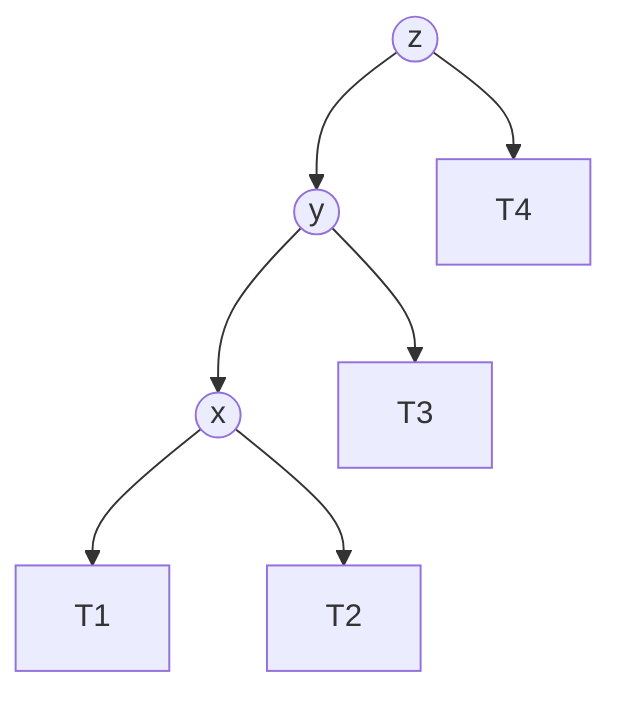

**Depois:**


**Implementação:**

```c
// Rotação simples à direita em torno de y
No* rotacaoDireita(No *y) {
    No *x = y->esq;           // x é filho esquerdo de y
    No *T2 = x->dir;          // T2 é subárvore direita de x

    // Executa rotação
    x->dir = y;               // y vira filho direito de x
    y->esq = T2;              // T2 vira filho esquerdo de y

    // Atualiza alturas (primeiro y, depois x)
    y->altura = max(altura(y->esq), altura(y->dir)) + 1;
    x->altura = max(altura(x->esq), altura(x->dir)) + 1;

    // Retorna nova raiz da subárvore
    return x;
}
```

!!! note "Ordem de atualização"
    Sempre atualize o nó que "desceu" primeiro (y), depois o que "subiu" (x).

### 4.2 Rotação Simples à Esquerda (Caso RR)

**Situação visual:**

**Antes (FB = -2, caso RR):**

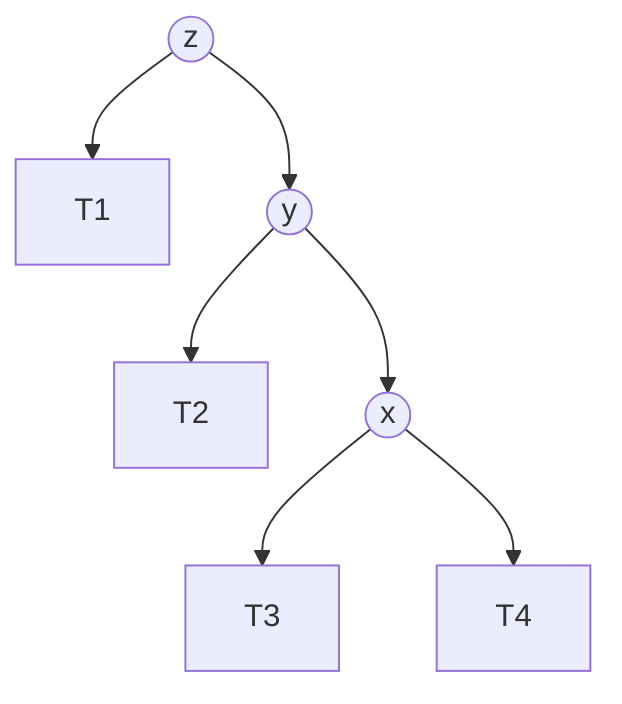

**Depois:**

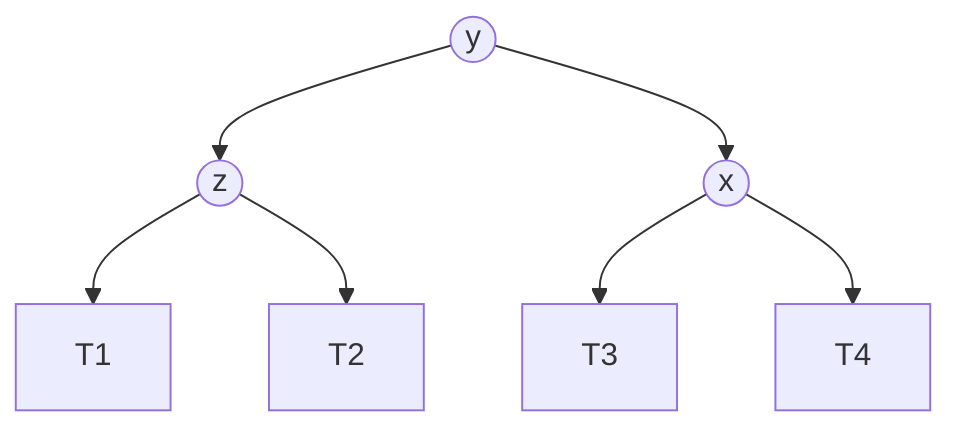

**Implementação:**

```c
// Rotação simples à esquerda em torno de x
No* rotacaoEsquerda(No *x) {
    No *y = x->dir;           // y é filho direito de x
    No *T2 = y->esq;          // T2 é subárvore esquerda de y

    // Executa rotação
    y->esq = x;               // x vira filho esquerdo de y
    x->dir = T2;              // T2 vira filho direito de x

    // Atualiza alturas
    x->altura = max(altura(x->esq), altura(x->dir)) + 1;
    y->altura = max(altura(y->esq), altura(y->dir)) + 1;

    return y;                 // Nova raiz
}
```

---

## 5. Inserção AVL: O Coração do Algoritmo

### 5.1 Estrutura Geral da Função

```c
No* inserir(No* no, int chave) {
    // ===== PASSO 1: Inserção padrão de ABB =====
    if (no == NULL)
        return novoNo(chave);

    if (chave < no->chave)
        no->esq = inserir(no->esq, chave);
    else if (chave > no->chave)
        no->dir = inserir(no->dir, chave);
    else
        return no;  // Chave duplicada: não insere

    // ===== PASSO 2: Atualizar altura do nó atual =====
    no->altura = 1 + max(altura(no->esq), altura(no->dir));

    // ===== PASSO 3: Verificar fator de balanceamento =====
    int fb = fatorBalanceamento(no);

    // ===== PASSO 4: Rebalancear se necessário (4 casos) =====

    // Caso LL: FB > 1 e chave inserida na esquerda da esquerda
    if (fb > 1 && chave < no->esq->chave)
        return rotacaoDireita(no);

    // Caso RR: FB < -1 e chave inserida na direita da direita
    if (fb < -1 && chave > no->dir->chave)
        return rotacaoEsquerda(no);

    // Caso LR: FB > 1 e chave inserida na direita da esquerda
    if (fb > 1 && chave > no->esq->chave) {
        no->esq = rotacaoEsquerda(no->esq);
        return rotacaoDireita(no);
    }

    // Caso RL: FB < -1 e chave inserida na esquerda da direita
    if (fb < -1 && chave < no->dir->chave) {
        no->dir = rotacaoDireita(no->dir);
        return rotacaoEsquerda(no);
    }

    // ===== PASSO 5: Retorna nó (possivelmente após rotação) =====
    return no;
}
```

### 5.2 Por Que Atualizar a Altura **Antes** de Verificar o FB?

```
❌ ERRADO:
1. Inserir nó
2. Calcular FB com alturas desatualizadas
3. → Decisão de rotação baseada em dados incorretos!

✅ CORRETO:
1. Inserir nó (recursivamente)
2. Atualizar altura do nó atual: altura = 1 + max(esq, dir)
3. Calcular FB com alturas corretas
4. Decidir rotação com base em FB preciso
```

!!! tip "Analogia"
    É como medir a temperatura antes de decidir se liga o ar-condicionado. Medir depois não faz sentido!

### 5.3 Por Que a Função Retorna `No*`?

```c
no->esq = inserir(no->esq, chave);  // ← Atribuição importante!
```

- Após uma rotação, a **raiz da subárvore muda**
- O retorno da função é o **novo topo** da subárvore balanceada
- A atribuição `no->esq = ...` ou `no->dir = ...` reconecta a árvore corretamente

**Antes da rotação:**

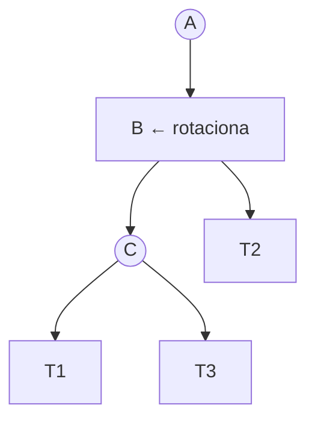

**Após rotação em B:**

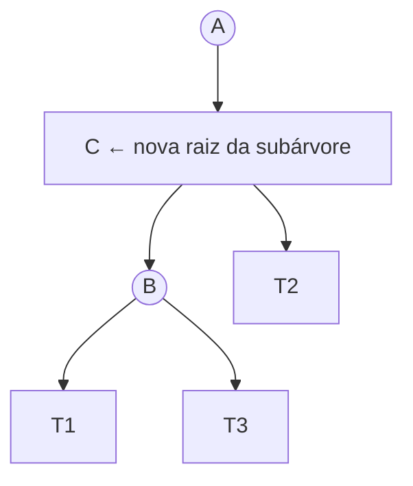

Sem a atribuição: `A->esq` ainda apontaria para B (antigo, agora filho). Com a atribuição: `A->esq = C` (novo topo) ✓

---

## 6. Funções de Apoio para Depuração

### 6.1 Percurso em Ordem (Validação de Ordenação)

```c
// Em-ordem: deve imprimir valores crescentes em uma ABB/AVL
void emOrdem(No *raiz) {
    if (raiz != NULL) {
        emOrdem(raiz->esq);
        printf("%d ", raiz->chave);
        emOrdem(raiz->dir);
    }
}
```

### 6.2 Impressão Visual da Árvore (Debug)

```c
// Imprime a árvore "deitada" (rotação de 90°)
void imprimirArvore(No *raiz, int nivel) {
    if (raiz == NULL) return;

    // Imprime subárvore direita primeiro (para visualização)
    imprimirArvore(raiz->dir, nivel + 1);

    // Imprime identação e valor [chave:altura, FB]
    for (int i = 0; i < nivel; i++) printf("    ");
    printf("[%d:h%d,FB%d]\n", raiz->chave, raiz->altura, fatorBalanceamento(raiz));

    // Imprime subárvore esquerda
    imprimirArvore(raiz->esq, nivel + 1);
}
```

**Exemplo de saída:**

```
Inserindo [10, 20, 30]:

[30:h1,FB0]
    [20:h2,FB0]
        [10:h1,FB0]

Interpretação:
- Raiz é 20 (altura 2, balanceada)
- 10 e 30 são folhas (altura 1)
```

### 6.3 Liberar Memória (Boa Prática)

```c
// Libera toda a árvore (pós-ordem)
void liberarAVL(No *raiz) {
    if (raiz != NULL) {
        liberarAVL(raiz->esq);
        liberarAVL(raiz->dir);
        free(raiz);
    }
}
```

---

## 7. Código Completo Compilável

```c
#include <stdio.h>
#include <stdlib.h>

// ===== Estrutura do nó =====
typedef struct No {
    int chave;
    int altura;
    struct No *esq;
    struct No *dir;
} No;

// ===== Funções auxiliares =====
int altura(No *n) {
    return (n == NULL) ? 0 : n->altura;
}

int max(int a, int b) {
    return (a > b) ? a : b;
}

No* novoNo(int chave) {
    No* no = (No*) malloc(sizeof(No));
    if (!no) { fprintf(stderr, "Erro de alocação\n"); exit(1); }
    no->chave = chave;
    no->esq = no->dir = NULL;
    no->altura = 1;
    return no;
}

int fatorBalanceamento(No *n) {
    return (n == NULL) ? 0 : altura(n->esq) - altura(n->dir);
}

// ===== Rotações =====
No* rotacaoDireita(No *y) {
    No *x = y->esq;
    No *T2 = x->dir;

    x->dir = y;
    y->esq = T2;

    y->altura = max(altura(y->esq), altura(y->dir)) + 1;
    x->altura = max(altura(x->esq), altura(x->dir)) + 1;

    return x;
}

No* rotacaoEsquerda(No *x) {
    No *y = x->dir;
    No *T2 = y->esq;

    y->esq = x;
    x->dir = T2;

    x->altura = max(altura(x->esq), altura(x->dir)) + 1;
    y->altura = max(altura(y->esq), altura(y->dir)) + 1;

    return y;
}

// ===== Inserção AVL =====
No* inserir(No* no, int chave) {
    // 1. Inserção BST padrão
    if (no == NULL) return novoNo(chave);

    if (chave < no->chave)
        no->esq = inserir(no->esq, chave);
    else if (chave > no->chave)
        no->dir = inserir(no->dir, chave);
    else
        return no;  // duplicata

    // 2. Atualiza altura
    no->altura = 1 + max(altura(no->esq), altura(no->dir));

    // 3. Calcula FB
    int fb = fatorBalanceamento(no);

    // 4. Rebalanceamento (4 casos)
    // LL
    if (fb > 1 && chave < no->esq->chave)
        return rotacaoDireita(no);
    // RR
    if (fb < -1 && chave > no->dir->chave)
        return rotacaoEsquerda(no);
    // LR
    if (fb > 1 && chave > no->esq->chave) {
        no->esq = rotacaoEsquerda(no->esq);
        return rotacaoDireita(no);
    }
    // RL
    if (fb < -1 && chave < no->dir->chave) {
        no->dir = rotacaoDireita(no->dir);
        return rotacaoEsquerda(no);
    }

    return no;
}

// ===== Utilitários =====
void emOrdem(No *raiz) {
    if (raiz) {
        emOrdem(raiz->esq);
        printf("%d ", raiz->chave);
        emOrdem(raiz->dir);
    }
}

void imprimirArvore(No *raiz, int nivel) {
    if (!raiz) return;
    imprimirArvore(raiz->dir, nivel + 1);
    for (int i = 0; i < nivel; i++) printf("    ");
    printf("[%d:h%d,FB%d]\n", raiz->chave, raiz->altura, fatorBalanceamento(raiz));
    imprimirArvore(raiz->esq, nivel + 1);
}

void liberarAVL(No *raiz) {
    if (raiz) {
        liberarAVL(raiz->esq);
        liberarAVL(raiz->dir);
        free(raiz);
    }
}

// ===== Main: Exemplo passo a passo =====
int main() {
    No *raiz = NULL;
    int valores[] = {10, 20, 30, 40, 50, 25};
    int n = sizeof(valores) / sizeof(valores[0]);

    printf("=== Inserção AVL passo a passo ===\n\n");

    for (int i = 0; i < n; i++) {
        printf("Inserindo %d:\n", valores[i]);
        raiz = inserir(raiz, valores[i]);
        imprimirArvore(raiz, 0);
        printf("\n");
    }

    printf("Percurso em-ordem (deve sair ordenado): ");
    emOrdem(raiz);
    printf("\n\n");

    printf("Estatísticas finais:\n");
    printf("  Altura da raiz: %d\n", altura(raiz));
    printf("  FB da raiz: %d\n", fatorBalanceamento(raiz));

    liberarAVL(raiz);
    return 0;
}
```

---

## 8. Execução Passo a Passo: Exemplo `[10, 20, 30, 40, 50, 25]`

### Inserção 10

`[10:h1,FB0]` → Árvore com 1 nó, balanceada ✓

### Inserção 20

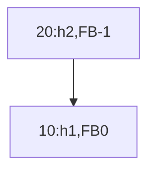

→ FB(20) = 0-1 = -1 ✓ (dentro de [-1,1])

### Inserção 30 → **Desbalanceamento RR!**

**Antes da rotação:**

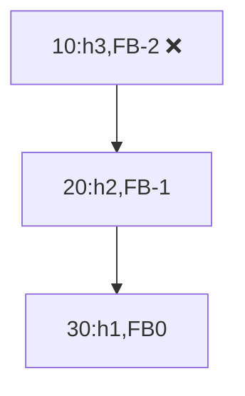

**Após rotação esquerda em 10:**

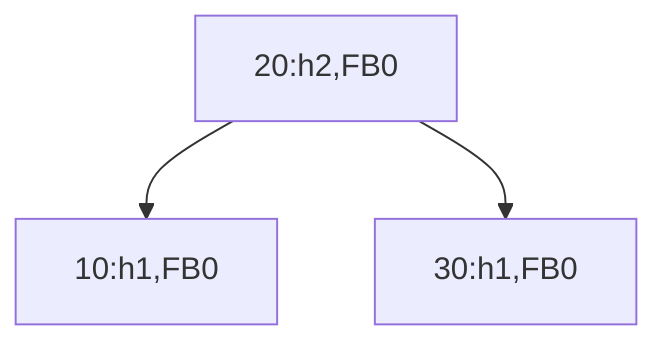

→ Balanceada! ✓

### Inserção 40

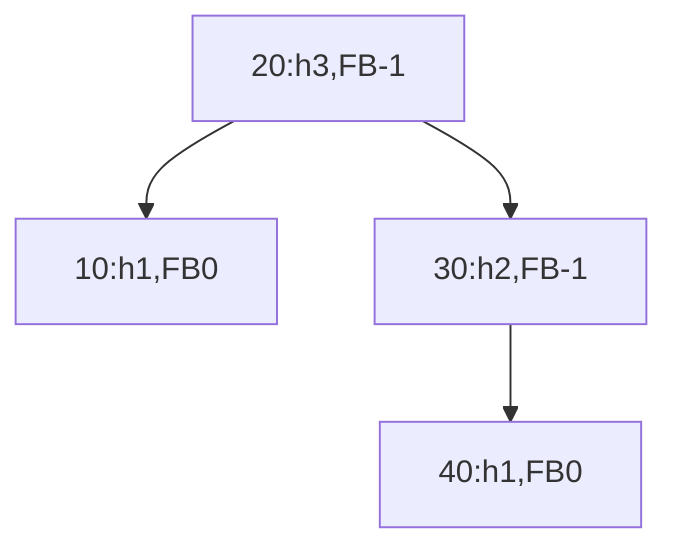

→ FB(20) = 1-2 = -1 ✓, FB(30) = 0-1 = -1 ✓

### Inserção 50 → **Desbalanceamento RR em 30!**

**Antes:**

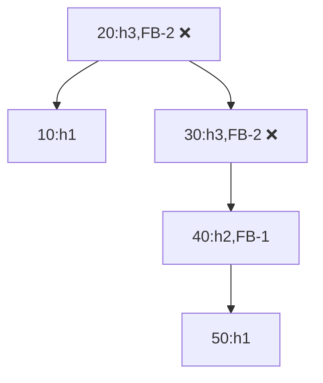

**Rotação esquerda em 30:**

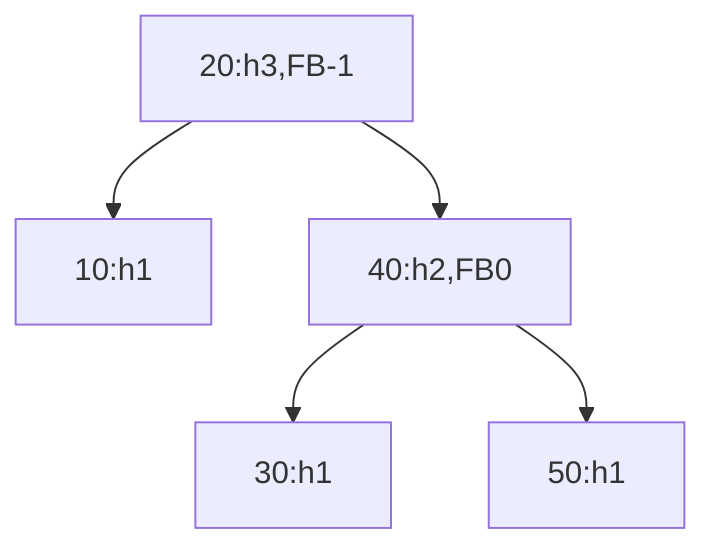

→ Balanceada! ✓

### Inserção 25 → **Desbalanceamento RL em 20!**

**Antes:**

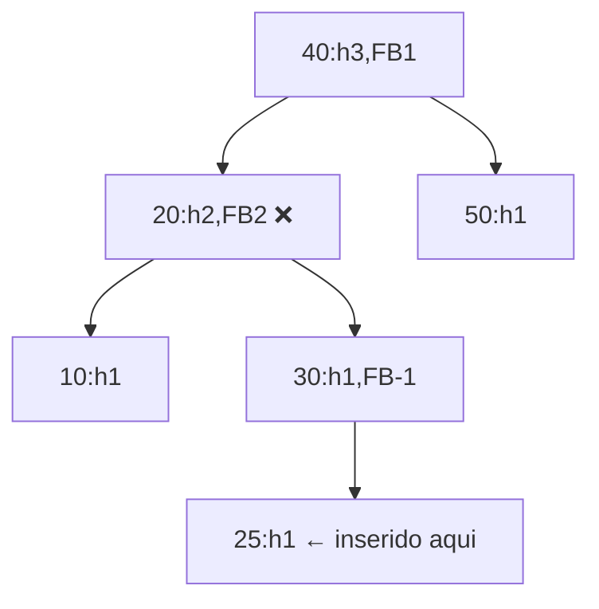

Caminho: 20 → Dir(30) → Esq(25) → Caso RL

**Passo 1: Rotação direita em 30:**

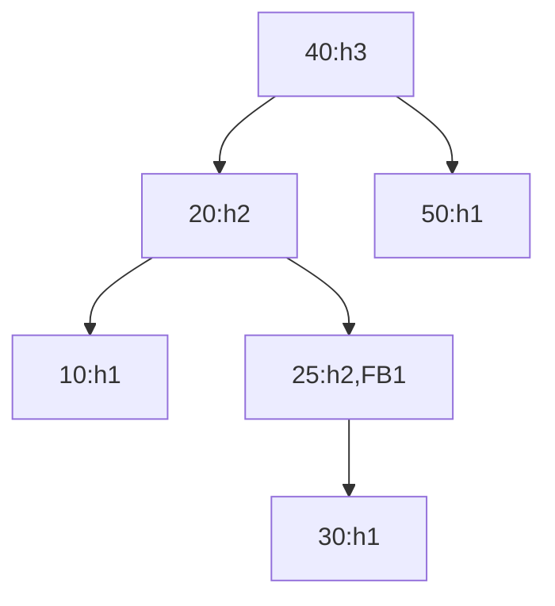

**Passo 2: Rotação esquerda em 20:**

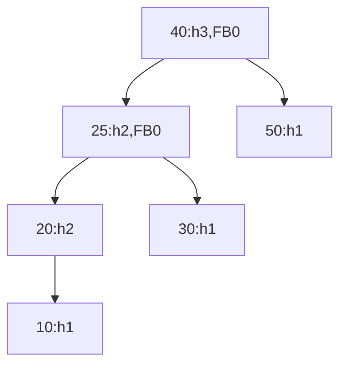

→ Balanceada! ✓

### Saída Final

```
Percurso em-ordem: 10 20 25 30 40 50  ← Ordenado! ✓

Estatísticas:
  Altura da raiz: 3
  FB da raiz: 0
```

!!! success "Verificação no VisuAlgo"
    Acesse [https://visualgo.net/en/bst](https://visualgo.net/en/bst), selecione "AVL", insira `[10,20,30,40,50,25]` e compare com nossa execução.

---

## 9. Exercícios para Fixação (Com Código)

### Exercício 1 — Validação de Ordenação

Modifique o `main()` para inserir os valores `[5, 3, 7, 1, 4, 6, 8]` e verifique:
a) O percurso em-ordem imprime os valores em ordem crescente?

b) Todos os nós têm `|FB| ≤ 1`?

c) Qual a altura final da árvore?

<details>
<summary>Gabarito esperado</summary>

```
a) Saída em-ordem: 1 3 4 5 6 7 8 ✓
b) Sim, todos os FB ∈ {-1, 0, 1}
c) Altura = 2 (árvore cheia com 7 nós)
```

</details>

### Exercício 2 — Inserção Ordenada (Caso Crítico)

Insira `[1, 2, 3, 4, 5, 6, 7]` em ordem crescente.

a) Quantas rotações ocorrem durante as inserções?

b) Qual a altura final da AVL?

c) Compare com a altura que uma ABB comum teria com a mesma sequência.

<details>
<summary>Resposta</summary>

```
a) Rotações:
   - Após inserir 3: rotação esquerda em 1
   - Após inserir 5: rotação esquerda em 2 (ou similar)
   - Após inserir 7: rotação esquerda em 4
   Total: 3 rotações simples

b) Altura final da AVL: 2

c) ABB comum degenerada: altura = 6
   Diferença: 6 vs 2 → busca em AVL é até 3x mais rápida!
```

</details>

### Exercício 3 — Função de Busca AVL

Implemente uma função de busca iterativa para AVL:

```c
No* buscar(No* raiz, int chave);
```

Teste buscando valores presentes e ausentes na árvore do Exercício 1.

<details>
<summary>Esboço de solução</summary>

```c
No* buscar(No* raiz, int chave) {
    while (raiz != NULL) {
        if (chave == raiz->chave)
            return raiz;
        else if (chave < raiz->chave)
            raiz = raiz->esq;
        else
            raiz = raiz->dir;
    }
    return NULL;  // não encontrado
}
```

</details>

### Exercício 4 — Desafio: Contar Rotações

Adicione um contador global ou passe por referência para contar quantas rotações foram executadas durante uma sequência de inserções:

```c
static int contadorRotacoes = 0;

// Dentro de cada caso de rotação na função inserir():
contadorRotacoes++;
```

Teste com sequências:

- Aleatória: `[42, 17, 89, 5, 33, 71]`
- Ordenada: `[1, 2, 3, 4, 5, 6]`
- Inversa: `[6, 5, 4, 3, 2, 1]`

Qual sequência exige mais rotações? Por quê?

---

## 10. Discussão: Por Que a Altura é Essencial na Inserção?

### Cenário Hipotético: E Se Não Atualizássemos a Altura?

```c
// ❌ VERSÃO COM ERRO (não atualiza altura):
No* inserirErrado(No* no, int chave) {
    if (no == NULL) return novoNo(chave);

    if (chave < no->chave)
        no->esq = inserirErrado(no->esq, chave);
    else if (chave > no->chave)
        no->dir = inserirErrado(no->dir, chave);

    // ❌ Altura não atualizada!
    // int fb = fatorBalanceamento(no);  ← FB calculado com dados velhos!

    return no;
}
```

**Consequências:**

1. O FB calculado será **incorreto** (baseado em alturas desatualizadas)
2. Rotações podem ser aplicadas **no momento errado** ou **não aplicadas quando necessário**
3. A árvore pode **permanecer desbalanceada** → perda da garantia O(log n)
4. Em casos extremos, pode causar **loop infinito** ou **corrupção de estrutura**

### Por Que Atualizar na Subida da Recursão?

```
Inserção é recursiva: inserir(raiz, chave)
1. Desce até encontrar posição de folha (caso base)
2. Cria novo nó
3. **Sobe** a pilha de chamadas, atualizando cada ancestral
4. Em cada nível, verifica FB e rotaciona se necessário

A altura só pode ser calculada APÓS as subárvores estarem prontas!
```

!!! tip "Analogia da construção"
    Você não pode medir a altura de um prédio enquanto ainda está construindo o andar de cima. Primeiro termina os andares superiores, depois mede de baixo para cima.

---

## 11. Resumo do Capítulo

**Estrutura do nó AVL:** campo `altura` é obrigatório para eficiência

**Funções auxiliares:** `altura()`, `max()`, `novoNo()`, `fatorBalanceamento()`

**Rotações implementadas:**

- `rotacaoDireita()`: caso LL
- `rotacaoEsquerda()`: caso RR
- Casos LR/RL: composição das duas simples

**Inserção AVL:**

1. Inserir como ABB
2. Atualizar altura do nó atual
3. Calcular FB
4. Aplicar rotação conforme caso
5. Retornar nova raiz da subárvore

**Importância crítica:** Atualizar altura **antes** de calcular FB

**Retorno de ponteiro:** Necessário para reconectar subárvores após rotação

**Validação:** Uso de `emOrdem()` e `imprimirArvore()` para depuração

**Boas práticas:** Verificar `malloc`, liberar memória com `free()`

---

## 12. Próximos Passos & Ferramentas

**Tópicos para próximos capítulos:**

- Remoção em AVL (mais complexa que inserção)
- Balanceamento em remoção: casos adicionais
- Comparação de desempenho: AVL vs. ABB vs. Hash Table

**Prática sugerida:**

1. **Compile e execute** o código completo da Seção 7
2. **Use o VisuAlgo** ([https://visualgo.net/en/bst](https://visualgo.net/en/bst)) para validar suas execuções
3. **Modifique o código** para imprimir mensagens quando uma rotação ocorrer:
    
    ```c
    printf("  → Rotação DIREITA em %d\n", no->chave);
    ```
    
4. **Teste casos extremos**: inserção ordenada, inversa, aleatória

**Leitura complementar:**

- ZIVIANI, N. *Projeto de Algoritmos*. Seção 5.4: Implementação de AVL.
- CORMEN et al. *Introduction to Algorithms*. Capítulo 13: Red-Black Trees (próximo nível de balanceamento).

---

!!! note "Dica para provas e trabalhos"
    - Sempre desenhe a árvore **antes** de codificar
    - Anote alturas e FB ao lado de cada nó durante a simulação manual
    - Use `printf` estratégicos para rastrear a execução passo a passo
    - Valide no VisuAlgo para ganhar confiança no raciocínio

---

*Material elaborado para a disciplina de Estrutura de Dados — Curso de Engenharia de Computação*

*Prof. Sérgio Souza Costa | Atualizado: 2026*

---