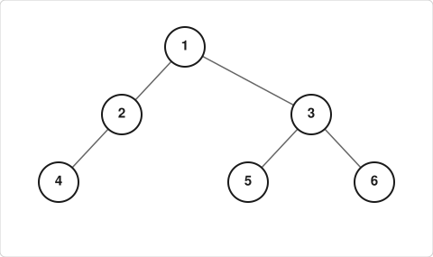

# Lista de Exercícios — Árvores Binárias (Estruturais)

## *Foco: Conceitos, Percursos e Operações Estruturais*

!!! warning "Atenção"
    Esta lista trabalha **apenas com árvores binárias genéricas**.

    **Não assuma propriedades de Árvore Binária de Busca (ABB)** — não há ordenação entre chaves.

    Operações como inserção/remoção com base em comparação de valores **não são solicitadas aqui**.

---

## 📋 Código inicial

```c
#include <stdio.h>
#include <stdlib.h>
#include <ctype.h>

typedef struct Arvore {
    int valor;
    struct Arvore* esquerda;
    struct Arvore* direita;
} Arvore;

/* Cria um nó da árvore */
Arvore* criar_arvore(int valor, Arvore* esq, Arvore* dir) {
    Arvore* nova = (Arvore*) malloc(sizeof(Arvore));

    nova->valor = valor;
    nova->esquerda = esq;
    nova->direita = dir;

    return nova;
}

/*
Formato da string:
(valor esquerda direita)

Exemplo:
(1 (2 (4 () ()) (5 () ())) (3 () ()))

() representa NULL
*/

Arvore* ler_arvore(const char** str) {
    while (**str == ' ')
        (*str)++;

    // árvore vazia
    if (**str == '(' && *(*str + 1) == ')') {
        (*str) += 2;
        return NULL;
    }

    if (**str != '(')
        return NULL;

    (*str)++; // pula '('

    while (**str == ' ')
        (*str)++;

    // lê número
    int valor = 0;

    while (isdigit(**str)) {
        valor = valor * 10 + (**str - '0');
        (*str)++;
    }

    while (**str == ' ')
        (*str)++;

    Arvore* esq = ler_arvore(str);

    while (**str == ' ')
        (*str)++;

    Arvore* dir = ler_arvore(str);

    while (**str == ' ')
        (*str)++;

    if (**str == ')')
        (*str)++;

    return criar_arvore(valor, esq, dir);
}

/* Imprime árvore indentada */
void imprimir_indentada(Arvore* arv, int nivel) {
    if (arv == NULL)
        return;

    for (int i = 0; i < nivel; i++)
        printf("    ");

    printf("%d\n", arv->valor);

    imprimir_indentada(arv->esquerda, nivel + 1);
    imprimir_indentada(arv->direita, nivel + 1);
}

/* Libera memória */
void destruir_arvore(Arvore* arv) {
    if (arv == NULL)
        return;

    destruir_arvore(arv->esquerda);
    destruir_arvore(arv->direita);

    free(arv);
}

int main() {
    const char* texto =
        "(1 (2 (4 () ()) (5 () ())) (3 () ()))";

    Arvore* raiz = ler_arvore(&texto);

    printf("Arvore indentada:\n\n");

    imprimir_indentada(raiz, 0);

    destruir_arvore(raiz);

    return 0;
}
```

### Regras Gerais

- Todas as funções devem ser **recursivas**, salvo indicação contrária.
- Árvores vazias são representadas por `NULL`.
- Use `int` para valores e retornos lógicos (`1` = verdadeiro, `0` = falso).
- Libere a memória com `liberar_arvore()` ao final dos programas de teste.

---

## 🔹 Nível 1: Representação e Compreensão Estrutural

### Exercício 1 — Da Notação Textual para o Desenho

Dada a representação textual:

```
T = {10, {20, {30, NULL, NULL}, {40, NULL, NULL}}, {50, NULL, {60, {70, NULL, NULL}, NULL}}}
```

a) Desenhe a árvore correspondente em formato gráfico.

b) Identifique:

i) Nós folha

ii) Grau da árvore

iii) Altura da árvore

iv) Nível do nó com valor `60`

v) Descendentes do nó com valor `20`

### Exercício 2 — Montagem com `criar_arvore`

Escreva um programa em C que:
a) Crie a árvore do Exercício 1 usando **apenas** a função `criar_arvore()`.

b) Imprima os três percursos (pré-ordem, em-ordem, pós-ordem).

c) Libere toda a memória ao final.

### Exercício 3 — Previsão de Percursos

Considere a árvore binária abaixo:



Sem executar código, determine a sequência de valores impressos por:
a) `pre_ordem(raiz)`

b) `em_ordem(raiz)`

c) `pos_ordem(raiz)`

> Dica: Anote a ordem de visita passo a passo antes de responder.

---

## 🔹 Nível 2: Funções Recursivas Básicas

### Exercício 4 — Contagem de Nós

Implemente:

```c
int contar_nos(Arvore* raiz);
```

Retorna o número total de nós. Teste com: árvore vazia, folha única e árvore com múltiplos níveis.

### Exercício 5 — Cálculo de Altura

Implemente:

```c
int altura(Arvore* raiz);
```

Retorna a altura da árvore, considerando:

- `altura(NULL) = -1`
- `altura(folha) = 0`

### Exercício 6 — Contagem de Folhas

Implemente:

```c
int contar_folhas(Arvore* raiz);
```

Retorna quantos nós são folhas (ambos os filhos são `NULL`).

### Exercício 7 — Soma de Valores

Implemente:

```c
int soma_valores(Arvore* raiz);
```

Retorna a soma de todos os valores `int` armazenados na árvore.

---

## 🔹 Nível 3: Operações Estruturais e Transformações

### Exercício 8 — Espelhamento (Reflexão)

Implemente:

```c
void espelhar(Arvore* raiz);
```

Inverte a árvore trocando subárvore esquerda ↔ direita em **todos** os nós (modificação *in-place*).

> Teste: imprima o percurso em-ordem antes e depois para verificar.

### Exercício 9 — Cópia Profunda de Árvore

Implemente:

```c
Arvore* copiar_arvore(Arvore* raiz);
```

Retorna um ponteiro para uma **nova árvore** com mesma estrutura e valores.

> Os nós da cópia devem ocupar endereços de memória distintos dos originais.

### Exercício 10 — Verificação: Estritamente Binária

Implemente:

```c
int eh_estritamente_binaria(Arvore* raiz);
```

Retorna `1` se **todo nó** tem grau 0 ou 2; retorna `0` caso contrário.

---

## 🔹 Nível 4: Desafios Estruturais (Sem Ordenação)

### Exercício 11 — Similaridade Estrutural

Duas árvores binárias são **SIMILARES** se possuem a mesma "forma" (distribuição de nós), independentemente dos valores armazenados.

Implemente:

```c
int sao_similares(Arvore* a1, Arvore* a2);
```

Regra recursiva:

- Ambas `NULL` → similares (`1`)
- Uma `NULL` e outra não → não similares (`0`)
- Ambas não-`NULL` → similares se **subárvores esquerdas forem similares** E **subárvores direitas forem similares**

> Os valores dos nós **não** influenciam o resultado.

### Exercício 12 — Igualdade Estrutural e de Valores

Duas árvores são **IGUAIS** se são estruturalmente similares **e** armazenam os mesmos valores nos nós correspondentes.

Implemente:

```c
int sao_iguais(Arvore* a1, Arvore* a2);
```

### Exercício 13 — Contagem de Nós com Um Único Filho

Implemente:

```c
int contar_nos_um_filho(Arvore* raiz);
```

Retorna quantos nós possuem **exatamente um filho** (esquerda XOR direita não-`NULL`).

### Exercício 14 — Nós em um Nível Específico

Implemente:

```c
int contar_nos_no_nivel(Arvore* raiz, int nivel);
```

Retorna quantos nós estão no nível informado (`raiz` está no nível 0).

> Dica: use recursão com decremento de `nivel` a cada chamada.

### Exercício 15 — Impressão Formatada com Indentação

Implemente:

```c
void imprimir_formatado(Arvore* raiz, int nivel);
```

Imprime a árvore com indentação visual, ex.:

```
10
├─ 20
│  ├─ 30
│  └─ 40
└─ 50
   └─ 60
```

> Chame inicialmente com `imprimir_formatado(raiz, 0);`

---

## 🔹 Bônus: Funções Utilitárias

### Exercício B1 — Liberar Memória (Pós-ordem)

Implemente:

```c
void liberar_arvore(Arvore* raiz);
```

Libera recursivamente toda a memória alocada. Use percurso **pós-ordem** para garantir que filhos sejam liberados antes dos pais.

### Exercício B2 — Busca de Valor (Sem Ordenação)

Implemente:

```c
int buscar_valor(Arvore* raiz, int alvo);
```

Retorna `1` se `alvo` existe em algum nó da árvore; `0` caso contrário.

> Como não é ABB, percorra **toda** a árvore se necessário.

### Exercício B3 — Máximo Valor na Árvore

Implemente:

```c
int valor_maximo(Arvore* raiz);
```

Retorna o maior valor `int` armazenado.

> Assuma que a árvore **não está vazia**. Dica: compare raiz, máximo da esquerda e máximo da direita.

---

## 📦 Arquivo Cabeçalho Sugerido (`arvore_binaria.h`)

```c
#ifndef ARVORE_BINARIA_H
#define ARVORE_BINARIA_H

typedef struct Arvore {
    int valor;
    struct Arvore* esquerda;
    struct Arvore* direita;
} Arvore;

// Função fornecida
Arvore* criar_arvore(int valor, Arvore* esq, Arvore* dir);

// Percursos
void pre_ordem(Arvore* raiz);
void em_ordem(Arvore* raiz);
void pos_ordem(Arvore* raiz);

// Operações básicas
int contar_nos(Arvore* raiz);
int altura(Arvore* raiz);
int contar_folhas(Arvore* raiz);
int soma_valores(Arvore* raiz);

// Transformações
void espelhar(Arvore* raiz);
Arvore* copiar_arvore(Arvore* raiz);

// Verificações estruturais
int eh_estritamente_binaria(Arvore* raiz);
int sao_similares(Arvore* a1, Arvore* a2);
int sao_iguais(Arvore* a1, Arvore* a2);
int contar_nos_um_filho(Arvore* raiz);
int contar_nos_no_nivel(Arvore* raiz, int nivel);

// Utilitárias
void imprimir_formatado(Arvore* raiz, int nivel);
void liberar_arvore(Arvore* raiz);
int buscar_valor(Arvore* raiz, int alvo);
int valor_maximo(Arvore* raiz);

#endif
```

---

## ✅ Critérios de Avaliação Sugeridos

| Critério | Pontuação |
| --- | --- |
| Correção lógica e recursiva | 40% |
| Tratamento de casos-base (`NULL`) | 20% |
| Clareza e legibilidade do código | 15% |
| Testes adequados (incluindo árvore vazia) | 15% |
| Liberação correta de memória | 10% |

---

!!! tip "Dica para resolução"
    1. Desenhe a árvore antes de codificar.
    2. Identifique o **caso base** da recursão (geralmente `raiz == NULL`).
    3. Pense: "O que faço com a raiz? E com as subárvores?"
    4. Teste incrementalmente: folha → árvore pequena → árvore complexa.