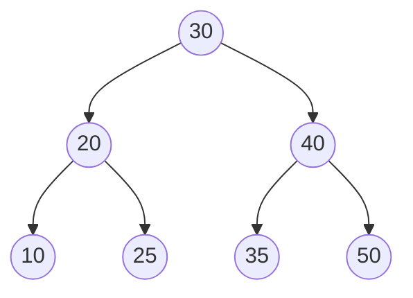

# Exercícios sobre Árvores AVL

**1.** Qual é o requisito fundamental para que uma árvore binária de busca seja considerada uma árvore AVL? Explique também como é calculado o fator de balanceamento de um nó, considerando a definição: `FB = Altura(SAD) - Altura(SAE)`.

**2.** Para cada uma das árvores binárias de busca abaixo (representadas em notação parentética), calcule o fator de balanceamento de todos os nós e justifique quais são AVL e quais não são:

- `A(5, 3(1, 4), 8(6, 9))`
- `B(10, 5(2, 7(6, 8)), 15(12, 18(16, 20)))`
- `C(4, 2(1, 3), 6(5, 7(8, 9)))`

**3.** Seja uma árvore AVL inicialmente vazia. Mostre seu estado final após a inserção, **nessa ordem**, dos elementos: `2, 1, 3, 4, 5, 7`. Indique em qual momento ocorrem rotações, qual o tipo (LL, RR, LR, RL) e, ao final, apresente a saída da travessia **em pós-ordem**.

**4.** Seja uma árvore AVL inicialmente vazia. Execute as seguintes operações na ordem indicada:

- Inserir: `4, 1, 0, 5, 3, 7, 2, 9`
- Remover: `5` e depois `3`
- Inserir: `10, 21, -5`

Mostre a estrutura da árvore após cada operação que causar desbalanceamento, descreva a rotação aplicada e, ao término de todas as operações, apresente a sequência de nós em **pós-ordem**.

**5.** Considere a árvore AVL abaixo (desenhe-a antes de responder):

a) Calcule o fator de balanceamento de cada nó.

b) Remova o nó com valor `20` e mostre as rotações necessárias para reestabelecer a propriedade AVL.

c) Apresente a árvore resultante e sua travessia **em pós-ordem**.

**6.** Dada a sequência de inserção: `12, 6, 18, 3, 9, 15, 21, 1, 4, 8, 10`.

Construa a árvore AVL passo a passo, indicando explicitamente o tipo de rotação aplicada sempre que o fator de balanceamento sair de `{-1, 0, 1}`. Ao final, liste os nós visitados em **pós-ordem**.

**7.** Classifique como Verdadeiro (V) ou Falso (F) e justifique tecnicamente:

- ( ) Toda árvore AVL é uma árvore binária de busca perfeitamente balanceada (altura mínima absoluta).
- ( ) A altura máxima de uma AVL com `n` nós é limitada por `≈ 1.44·log₂(n+2)`.
- ( ) Se o fator de balanceamento de um nó for `2` ou `-2`, a árvore deixa de ser AVL até que uma rotação seja aplicada.
- ( ) A remoção de um nó em uma AVL pode exigir mais de uma rotação para reequilibrar a estrutura.

**8.** Uma árvore AVL contém os nós `{8, 4, 12, 2, 6, 10, 14}`.
a) Desenhe a árvore e calcule o fator de balanceamento de cada nó.

b) Insira os valores `1` e `15` (nessa ordem), mostrando as rotações necessárias.

c) Após as inserções, apresente a árvore final e a sequência em **pós-ordem**.

**9.** (Desafio) Seja uma AVL vazia. Insira a sequência: `50, 30, 70, 20, 40, 60, 80, 10, 25, 35, 45`. Em seguida, remova `30` e `70`.

- Mostre apenas os estados da árvore antes e depois de cada rotação.
- Calcule o fator de balanceamento de todos os nós na árvore final.
- Forneça a saída em **pós-ordem** da árvore resultante.

**10.** Explique, com suas palavras, por que a operação de remoção em uma árvore AVL pode exigir o "propagação do desbalanceamento" até a raiz, enquanto a inserção normalmente exige no máximo duas rotações em um único caminho. Ilustre com um exemplo mínimo de 4 nós.

---

## 💡 Dicas para resolução

- Use a definição solicitada: `FB = Altura(SAD) - Altura(SAE)`. Valores válidos em uma AVL: `-1, 0, 1`.
- Rotações: `LL` → rotação simples à direita; `RR` → rotação simples à esquerda; `LR` → rotação dupla (esquerda-direita); `RL` → rotação dupla (direita-esquerda).
- Pós-ordem: visite a subárvore esquerda, depois a direita, e por fim a raiz.
- Desenhe passo a passo. A maioria dos erros vem de pular a atualização de alturas após rotações ou remoções.